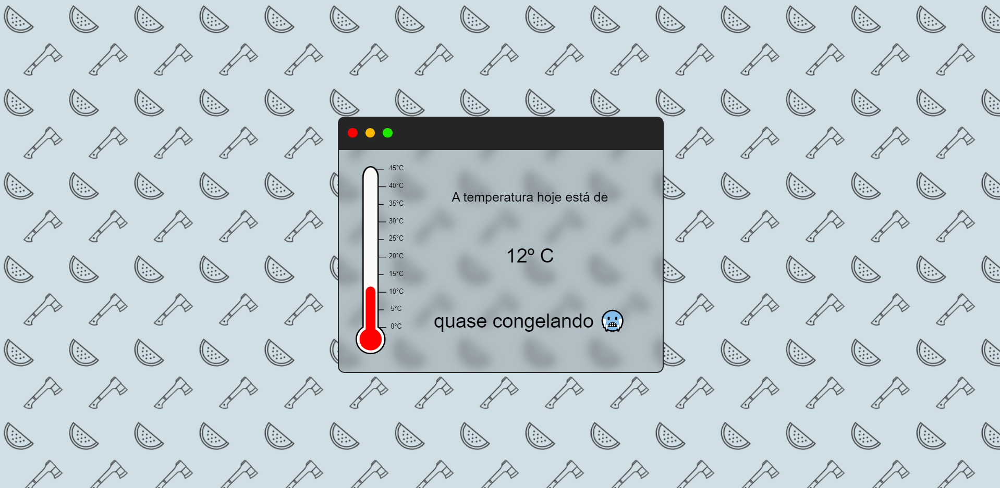

<h3 align="center"> Thermometer </h3>

<br>



## :computer: Project

The objective is simple, generate a thermometer that shows random temperatures.

### :heavy_check_mark: Requirements 

Para a criação do projeto, foram utilizados os seguintes requisitos:

- Node v14.18.0
- VueJS 2.6.14
  
### :rocket: Technologies

- <a href="https://vuejs.org/v2/guide/">VueJS 2.6.14</a>

### :mega: How to use 

Project setup
```
npm install
```

Compiles and hot-reloads for development
```
npm run serve
```

<p align="center">
  <a href="https://github.com/thrnkk" ></a>
</p>